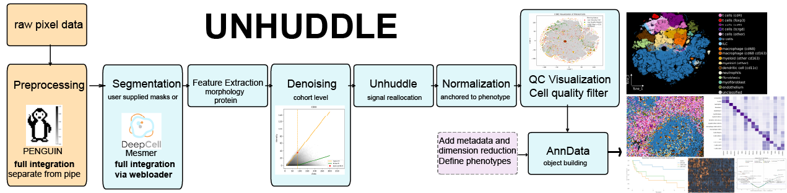
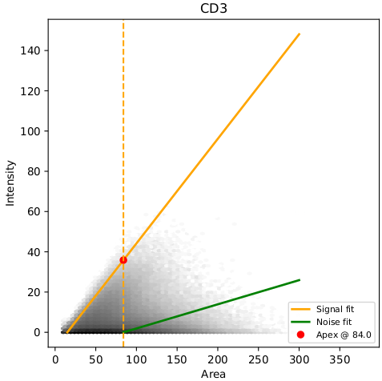

<h2>
  UNHUDDLE
  
</h2>

**Uncovering Neighborhood Heterogeneity Using Deterministic Normalization and Local Equilibrium**

<br>UNHUDDLE is an algorithm designed to resolve signal in densely packed tissue regions — or "cell huddles" — in multiplex spatial proteomics, where traditional absolute segmentation introduces 'neighbor noise' and blur the phenotypic signal.

On the cell to cell borderpixels, shared signal is observed due to  
1. resolution issues,
2. lateral bleed/signal spill
3. z-projection.  <br>

Unhuddle knows the cell's neighbors, measures their claim to borderpixelintensity and reallocates the bordersignal to the rightful owner. Unhuddle is equiped with an optional denoiser that may be very effective on your dataset if you have a total cell number of >100,000 (however the more the better). NB total cell number is a summation over all fovs on the same staining/aquisition batch. 

Unhuddle values are normalized by average phenotype marker expression, defending against variation in overall staining intensity between fovs and consequently normalized by cell size (surface). By identifying stable, broadly expressed "normalisation markers" and performing per-cell normalization, UNHUDDLE enables more accurate within-cell-type comparison of functional markers (e.g., checkpoint proteins), even in spatially crowded microenvironments. 

The Unhuddle pipeline is built to empower all curious scientists — whether you're a coding pro or just getting started. While you’ll need to install Python and interact with the command line, our walkthrough makes this process straightforward and accessible.

Unhuddle runs directly on your multiplexed {marker}.ome.tiff image files, producing a comprehensive AnnData object that packages your cell-level features, masks, spatial coordinates, and marker intensities — all ready for analysis. If you don’t already have segmentation masks, Unhuddle can optionally generate them for you using DeepCell-Mesmer, enabling a truly end-to-end experience.

### 🔧 **Preprocessing Your Raw Images**

Before running UNHUDDLE, we **highly recommend** some minimal pixel-level preprocessing of your raw `.ome.tiff` images. At a minimum, preprocessing should include:

- ✅ 99th highest percentile clipping (removal of oversaturated pixels)  
- ✅ Background subtraction


<details>
<summary>Several open-source tools are available to help with IMC/MIBI data for this (click to expand):</summary>

---

### 🐧 **PENGUIN – Multiplex Tissue Image Preprocessing GUI**

- A user-friendly graphical interface for preprocessing multiplexed tissue images
- Available as a packaged Streamlit app **integrated in UNHUDDLE** (or use the jupyter notebook widget version on the 🔗  [PENGUIN](https://github.com/deMirandaLab/PENGUIN) github)


<details>
<summary><strong>🧪 Launch the Streamlit version of PENGUIN</strong></summary>

#### 🔁 Step-by-step (Mac/Linux/Windows)

Credits: Sequeira, A. M., Ijsselsteijn, M. E., Rocha, M., & de Miranda, N. F. (2024). PENGUIN: A rapid and efficient image preprocessing tool for multiplexed spatial proteomics. bioRxiv, 2024-07. doi: https://doi.org/10.1101/2024.07.01.601513
1. **Clone the Repository** (this is the same step as STEP 1 from the main flow, there is no need to clone twice)  
    - via https:
        ```bash
        git clone https://github.com/tbee05/unhuddle_denoise.git
        cd unhuddle_denoise
        ```
    - or via ssh:
        ```powershell
        git clone git@github.com:tbee05/unhuddle_denoise.git
        cd unhuddle_denoise
        ```
        
2. **Create a virtual environment** (make a dedicated environment for penguin)
    ```bash
    python -m venv .venv_penguin
    ```

3. **Activate it**
    - On macOS/Linux:
        ```bash
        source .venv_penguin/bin/activate
        ```
    - On Windows:
        ```powershell
        .venv_penguin\Scripts\activate
        ```

4. **Install requirements**
    - On macOS/Linux:
        ```bash
        pip install -r ./penguin_preprocess/requirements.txt
        ```
    - On Windows:
        ```powershell
        pip install -r .\penguin_preprocess\requirements.txt
        ```
       
5. **Run the app**
    ```bash
    streamlit run app.py
    ```


<details>
<summary> More raw data images needed to test this Streamlit version of PENGUIN? (expand!)</summary>


**Download raw image data** Oneliners that will download and unpack all available raw demo FOVs into `demodata-raw/{FOV}` (1.5GB).

#### 🐧 Linux / macOS / WSL (make sure you are still in the unhuddle base directory!)
```bash
rm -rf demodata-raw && mkdir -p demodata-raw && curl -s https://api.github.com/repos/Tbee05/Unhuddle-raw/releases/latest | grep browser_download_url | grep '.tar.gz"' | cut -d '"' -f 4 | while read -r url; do fov=$(basename "$url" .tar.gz); mkdir -p demodata-raw/$fov && wget --show-progress -q "$url" -O ${fov}.tar.gz && tar -xzf ${fov}.tar.gz -C demodata-raw/$fov --strip-components=1 && rm ${fov}.tar.gz; done
```

#### 🪟 Windows (PowerShell) (make sure you are still in the unhuddle base directory!)
```powershell
Remove-Item -Recurse -Force demodata-raw -ErrorAction SilentlyContinue; New-Item -ItemType Directory -Force -Path "demodata-raw" | Out-Null; Invoke-RestMethod https://api.github.com/repos/Tbee05/Unhuddle_demodata/releases/latest | % { $_.assets } | ? { $_.name -like "*.zip" } | % { $fov = $_.name -replace ".zip",""; New-Item -ItemType Directory -Force -Path "demodata-raw\$fov" | Out-Null; Invoke-WebRequest -Uri $_.browser_download_url -OutFile "$fov.zip"; Expand-Archive -Path "$fov.zip" -DestinationPath "demodata-raw\$fov" -Force; Remove-Item "$fov.zip" -Force }
```

</details>


</details>

---

### 🧼 **IMC-Denoise – Deep Learning Denoising for IMC**

- Content-aware denoising pipeline tailored for Imaging Mass Cytometry (IMC)  
- Combines pixel artifact removal and self-supervised noise suppression  
- Best suited for high-noise or laser-induced artifact scenarios

🔗 GitHub: [IMC-Denoise](https://github.com/PENGLU-WashU/IMC_Denoise)

</details>

Once your data is preprocessed, Unhuddle takes care of the rest — integrating morphometrics, reallocation models, functional normalization, and quality control in one modular framework. The resulting AnnData object can be extended with your own metadata or omics layers and is fully compatible with Scanpy and SpaceCat workflows. We've included example Jupyter notebooks to help you dive into downstream analyses and visualizations.

 


---


  
## 🚀 Getting Started with UNHUDDLE

## 📥 1. Clone the Repository
via https
```bash
git clone https://github.com/tbee05/unhuddle_denoise.git
cd unhuddle_denoise
```
via ssh
```bash
git clone git@github.com:tbee05/unhuddle_denoise.git
cd unhuddle_denoise
```
## 📦 2. Set Up a Virtual Environment
Using `venv`

- On macOS/Linux:
```bash
python -m venv unhuddle-denoise
source unhuddle-denoise/bin/activate
```

- On Windows:
```bash
python -m venv unhuddle-denoise
unhuddle-denoise\Scripts\activate
```

or `conda`:
```bash
conda create -n unhuddle-denoise -y
conda activate unhuddle-denoise
conda install pip
```
## 🛠️ 3. Install UNHUDDLE in Editable Mode
```bash
pip install -e .
```
This installs unhuddle as a CLI tool available from anywhere in your terminal.

## ✅ 4. Verify Installation
```bash
unhuddle-denoise --help
```
Should print a list of CLI arguments and options.

## 🗂️ 5. Check Input Requirements

The base input directory should contain one folder per FOV:

```
base_path/
├── FOV1/
│   ├── CD3.ome.tiff
│   ├── CD20.ome.tiff
│   └── ...
├── FOV2/
│   ├── CD3.ome.tiff
│   └── ...
```
Each FOV folder should contain:
- Denoised marker images (`{marker}.ome.tiff`, shape: `H x W`, dtype: `float32/64`)
- Optionally: a segmentation mask (`*.tiff`, shape:   `H x W` or `Z x H x W`, dtype: `uint16`)  
  NB do not use *ome.tiff for the mask  
  NB the pipeline will detect and squeeze the Z dimension automatically)  
  If a mask is not provided, one can be generated using `--create_deepcell_mask`.

🎯**protip:**  
contain the patientID in the FOV-name: "{patientID}_{FOVnumber}".  
NB do not use underscores within patientID or FOVnumber.
 
example for the first fov of **P**atient **23**:
```
base_path/
├── P23_1/
│   ├── CD3.ome.tiff
```
## 🧪 6. Run the Pipeline on Included Demo Data
linux:
```bash
unhuddle-denoise \
  --base_path demodata \
  --output_base_path results/unhuddle_output \
  --nuclear_markers DNA1 DNA2 HistoneH3 \
  --normalisation_markers CD20 CD68 CD11b CD11c CD8a CD3 CD7 CD45RA CD45RO CD15 CD163 Vimentin CD31 CD14 \
  --create_nuclear_mask \
  --max_workers 1 \
  --create_adata
```
windows powershell
```powershell
unhuddle-denoise `
  --base_path demodata `
  --output_base_path results\unhuddle_output `
  --nuclear_markers DNA1 DNA2 HistoneH3 `
  --normalisation_markers CD20 CD68 CD11b CD11c CD8a CD3 CD7 CD45RA CD45RO CD15 CD163 Vimentin CD31 CD14 `
  --create_nuclear_mask `
  --max_workers 1 `
  --create_adata
```


## 🌐 7. DeepCell Integration

UNHUDDLE can upload overlays to [DeepCell.org](https://deepcell.org) using Selenium and Firefox with GeckoDriver — **no GUI interaction required**. This enables a fully automated pipeline from raw pixel data to single-cell DeepCell predictions.

### 🛠️ Manual Setup: Firefox + GeckoDriver

If Firefox or GeckoDriver is not already installed, follow these steps to install both locally in `~/tools` or `%USERPROFILE%\tools`.

---

<details>
<summary><strong>🐧 Linux Instructions</strong></summary>

### 🦊 1. Install Firefox (Portable)
```bash
mkdir -p "$HOME/tools"
cd "$HOME/tools"
wget "https://download.mozilla.org/?product=firefox-latest&os=linux64&lang=en-US" -O firefox.tar.bz2
tar -xjf firefox.tar.bz2
```

Firefox will now be available at:
```bash
$HOME/tools/firefox/firefox
```

💡 To make it available system-wide:
```bash
export PATH="$HOME/tools/firefox:$PATH"
```

👉 Add that line to your `.bashrc` or `.zshrc` to make it permanent.

### 🧭 2. Install GeckoDriver
```bash
cd "$HOME/tools"
wget https://github.com/mozilla/geckodriver/releases/download/v0.35.0/geckodriver-v0.35.0-linux64.tar.gz
tar -xvzf geckodriver-*.tar.gz
chmod +x geckodriver
```

✅ GeckoDriver path:
```bash
$HOME/tools/geckodriver
```

💡 Add to PATH:
```bash
export PATH="$HOME/tools:$PATH"
```

</details>

---

<details>
<summary><strong>🍎 macOS Instructions</strong></summary>

### 🦊 1. Install Firefox
Download from:  
[https://www.mozilla.org/en-US/firefox/new/](https://www.mozilla.org/en-US/firefox/new/)

Or manually place `Firefox.app` in a custom folder like:
```bash
$HOME/tools/Firefox.app
```

💡 To use it in scripts:
```bash
export PATH="$HOME/tools/Firefox.app/Contents/MacOS:$PATH"
```

### 🧭 2. Install GeckoDriver
```bash
cd "$HOME/tools"
curl -LO https://github.com/mozilla/geckodriver/releases/download/v0.35.0/geckodriver-v0.35.0-macos.tar.gz
tar -xvzf geckodriver-*.tar.gz
chmod +x geckodriver
```

✅ GeckoDriver path:
```bash
$HOME/tools/geckodriver
```

💡 Add to PATH:
```bash
export PATH="$HOME/tools:$PATH"
```

</details>

---

<details>
<summary><strong>🪟 Windows Instructions (PowerShell)</strong></summary>

### 🦊 1. Install Firefox
Download from:  
[https://www.mozilla.org/en-US/firefox/new/](https://www.mozilla.org/en-US/firefox/new/)

During installation, choose **Custom Setup** and install to:
```
%USERPROFILE%\tools\Firefox
```

💡 Add this to your system `PATH`:
```powershell
[System.Environment]::SetEnvironmentVariable("Path", $env:Path + ";$env:USERPROFILE\tools\Firefox", [System.EnvironmentVariableTarget]::User)
```

### 🧭 2. Install GeckoDriver
```powershell
$toolsDir = "$env:USERPROFILE\tools"
New-Item -ItemType Directory -Force -Path $toolsDir
Set-Location -Path $toolsDir

Invoke-WebRequest -Uri "https://github.com/mozilla/geckodriver/releases/download/v0.35.0/geckodriver-v0.35.0-win64.zip" -OutFile "$toolsDir\geckodriver.zip"
Expand-Archive -Path "$toolsDir\geckodriver.zip" -DestinationPath $toolsDir -Force
Remove-Item "$toolsDir\geckodriver.zip"
```

💡 Add GeckoDriver to your `PATH`:
```powershell
[System.Environment]::SetEnvironmentVariable("Path", $env:Path + ";$env:USERPROFILE\tools", [System.EnvironmentVariableTarget]::User)
```

✅ GeckoDriver will now be available as:
```
%USERPROFILE%\tools\geckodriver.exe
```

</details>

---

<details>
<summary><strong>🧪 Verify Installation</strong></summary>

Run these to check that Firefox and GeckoDriver are installed correctly:

#### 🐧 macOS / Linux:
```bash
$HOME/tools/firefox/firefox --version
$HOME/tools/geckodriver --version
```

#### 🪟 Windows PowerShell:
```powershell
& "$env:USERPROFILE\tools\Firefox\firefox.exe" --version
& "$env:USERPROFILE\tools\geckodriver.exe" --version
```

</details>


---


<br>

## 🚀 8. Run the Full End-to-End Pipeline


<details>
<summary>🎯 𝗣𝗿𝗼 𝗧𝗶𝗽: Download Additional Demo Data for Testing of the Denoiser (click to expand)</summary>

The following commands will automatically download and unpack all available demo FOVs into `demodata/{FOV}` using the latest GitHub release (1.5GB).

#### 🐧 Linux / macOS / WSL
```bash
[ -d demodata ] && [ -f README.md ] && echo "Cleaning demodata..." && \rm -rf demodata && mkdir -p demodata && curl -s https://api.github.com/repos/Tbee05/Unhuddle_demodata/releases/latest | grep browser_download_url | grep '.tar.gz"' | cut -d '"' -f 4 | while read -r url; do fov=$(basename "$url" .tar.gz); mkdir -p demodata/$fov; wget --show-progress -q "$url" -O ${fov}.tar.gz && tar -xzf ${fov}.tar.gz -C demodata/$fov --strip-components=1 && rm ${fov}.tar.gz; done
```

#### 🪟 Windows (PowerShell)
```powershell
Invoke-RestMethod https://api.github.com/repos/Tbee05/Unhuddle_demodata/releases/latest | % { $_.assets } | ? { $_.name -like "*.zip" } | % { $fov = $_.name -replace ".zip",""; if (Test-Path "demodata\$fov") { Remove-Item "demodata\$fov\*" -Recurse -Force } else { New-Item -ItemType Directory -Force -Path "demodata\$fov" | Out-Null }; Invoke-WebRequest -Uri $_.browser_download_url -OutFile "$fov.zip"; Expand-Archive -Path "$fov.zip" -DestinationPath "demodata\$fov" -Force; Remove-Item "$fov.zip" -Force }
```

📂 Result: Each downloaded dataset will be extracted into its own `demodata/{FOV}` folder — ready for direct use with the UNHUDDLE pipeline with the `--use_denoise` flag enabled.

</details>  

---


**First test on the extensions on the demodata**
- Add `--use_denoise` if you've downloaded the additional demodata
- Add `--create_deepcell_mask` and `--geckodriver_path` if Firefox + GeckoDriver are installed

🚀🚀 **Congrats you made it to the end of the tutorial. Ready for your own data?**  

  - Replace `--base_path demodata` with the actual path to your folder containing `{FOV}\` subdirectories
  - use `--list_available_markers` and run the command
  - update the `--nuclear_markers` and the `normalisation_markers` (tip the normalisation markers give a rather ON/OFF signal, while other 'functional' markers are more normal distributed)
  - have your own masks? Add `--mask_pattern` -->Glob pattern to find your mask (e.g. `*_mask.tiff`). NB do not use `*.ome.tiff`
  - you do not have your own masks? Try the deepcell webloader function! Make sure to install firefox and geckodriver, add the flags `--create_deepcell_mask` and `--geckodriver_path`.
  - run the pipeline and check the overlay files, want to adapt the markers used for the overlay? use the overrides: `--nuclear-markers_overlay` and `--membrane-markers_overlay`, rerun.
    - Try `use_denoise`, the pipeline will calculate the number of total cells and will inform you when there is less than 100.000 cells, you can choose to skip denoise at that stage. Inspect the denoiser_QC.pdf!
  - Inspect all QC. Are you happy? Use the unhuddleRun dimension reduction using your favorite algorithm (currently not supported in Unhuddle) and load the coordinates in the pipeline using `--add_dimension_reduction`, `--coord_cols` and `--check_output_exist`. Rerun and you will see you filtering results in your dimension reduction render, which will be very helpful during phenotyping.
  - Did your phenotyping? Load the phenotypes as obs in your adata object! Add your metadata and your other omic data.
  - Not a pro in using scanpy and adata for analysis and visualisation? Use your favorite LLM and instruct the chatbot with the organisation of your object and just ask to give you jupyter notebook snippets to project features on your dimension reduction plot, render tissue images color coded for the various cell types. Happy sciencing!


## ⚙️ Pipeline Overview

For each FOV (field of view) folder, the following stages are run:

### 1. **Mask Processing & Interaction Computation**
- Segment cells, nuclei, and membranes using the provided marker images.
- Compute:
  - Border interactions (via membrane adjacency)
  - Background interactions (via contact with empty space)
- Output: a typed interaction dictionary used to model per-pixel signal flow.

### 2. **Feature Extraction**
- Extract per-cell morphological features (e.g., area, eccentricity, nucleus/cell ratios).
- Output saved to `/morphology_features/{fov}.csv`.

### 3. **Protein Intensity Extraction**
- Compute per-cell marker intensities using:
  - Cell mask
  - Membrane mask
  - Membrane exclusion mask
- Nuclear markers are excluded from this step.
- Output saved to `/protein_features/{fov}.csv`.

---

## 🧽 Denoising (Optional)  
  

### 4. **Cohort-Level Signal/Noise Decomposition**
- If `--use_denoised` is enabled:
  - A **piecewise linear model** is fit per marker using cell **area** and summed membrane-exclusion signal.
  - **Signal cones** are identified from small-area cells; **noise cones** from large-area cells.
  - The resulting **denoised reallocation factors** quantify the fraction of signal attributable to noise.
- For cohorts with <200,000 cells, denoising is less reliable and skipped unless the user opts in.
- Output:
  - `denoised_reallocation_summary.csv`
  
#### 🖼️ Denoiser Visualization Module
- Produces per-marker plots:
  - Hexbin density of Area vs. Intensity
  - Piecewise signal vs. noise fits
  - Apex anchors and model overlays
- Output saved as a storyboard PDF for cohort-level review.  

---

## 🔁 Reallocation and Rescaling

### 5. **Object-Intensity Reallocation**
- Merge morphological and protein features with the interaction dictionary.
- Redistribute membrane-excluded per-pixel intensities across interacting objects using weighted contributions.
- Output:
  - `/unhuddle_sum/{fov}.csv`
  - `/original_sum/{fov}.csv`

### 6. **Normalization**
- Apply normalization using `--normalisation_markers` (e.g., CD45, CD3, Vimentin):
  - Compute a **weighted mean normalization factor** per cell.
  - Scale all markers per cell using this factor.
  - Apply robust scaling to [0.1, 99.9] percentile range (per marker).
- Denoised reallocation intensities are used if `--use_denoised` is active.
- Output:
  - `/unhuddle_normalized/{fov}.csv`
  - `/original_normalized/{fov}.csv`

#### 🖼️ Normalization Visualization Module
- Generates:
  - Per-marker normalization range comparisons
  - Scatter plots of pre/post-normalized values
  - Cohort-level scaling factors
- All outputs saved to `/qc_normalization_plots/`.

---

## 📦 Optional Modules

### 7. **DeepCell Mask Creation**
- If `--create_deepcell_mask` is enabled:
  - RGB overlays are constructed from marker images to highlight relevant structures for segmentation.
  - By default, the overlay uses the markers specified in `--normalisation_markers` and `--nuclear_markers`.
  - You can **override the default overlay composition** using:
    - `--membrane_markers_overlay`
    - `--nuclear_markers_overlay`
  - Uploaded to [DeepCell.org](https://deepcell.org) using a headless Selenium session
  - Results are downloaded and integrated into downstream segmentation

---


### 8. **AnnData Object Creation**
- If `--create_adata` is used:
  - All per-FOV features, masks, and normalized intensities are assembled into a single `.h5ad` file
  - Includes QC flags, overlays, and spatial information
  - Compatible with `scanpy`, `napari`, and `SpaceCat` pipelines

### 9. **Automated Filtering & Embedding QC**
- Performed automatically on the assembled AnnData object
- Includes:
  - Low-intensity filtering (`QC_low_intensity_filter`)
  - Local density filtering (`QC_dr_based_filter`)
  - Optional spatial smoothing or embedding overlays
- Visual outputs:
  - Histograms of marker intensity
  - Density maps
  - Annotated DR embeddings (e.g., t-SNE, FIt-SNE)
  - Summary figures for each cohort
- Output:
  - `/qc_pipeline/` with all summary PDFs and CSVs


## 🧰 Available Arguments

### 📂 Input / Output

| Argument                     | Description |
|-----------------------------|-------------|
| `--base_path`               | **Required** Path to folder containing FOV subfolders |
| `--output_base_path`       | **Required** Where to write processed outputs (will be created) |
| `--fovs`                   | List of FOV folder names to process (optional) |
| `--mask_pattern`           | Glob pattern(s) for user imported mask files (e.g. `*_mask_0.tiff`). NB do not use `*.ome.tiff` |
| `--check_output_exist`     | Skip FOVs if output already exists |
| `--create_adata`           | Reconciles all data into a single `.h5ad` file |

### 🎨 Marker definitions

| Argument                     | Description |
|-----------------------------|-------------|  
| `--normalisation_markers` | **Required** unless using `--list_available_markers` |
| `--nuclear-markers`            | **Required** unless using `--list_available_markers` |  
| `--list_available_markers` | List markers and exit |

### ⚙️ Processing Options

| Argument                     | Description |
|-----------------------------|-------------|
| `--max_workers`            | Number of parallel processes (default: 1) |
| `--create_nuclear_mask`    | Generate nuclear mask from cell mask (enables N/C ratio) |
| `--create_deepcell_mask`   | Generate RGB overlay & segment via webloader with DeepCell Mesmer|

### 🌐 DeepCell Settings 

| Argument                   | Description |
|---------------------------|-------------|
| `--geckodriver_path`       | Path to geckodriver for Selenium. **Required when** `--create_deepcell_mask` is used. |
| `--deepcell_url`           | URL of the DeepCell website to connect to (default: `http://www.deepcell.org`). |
| `--deepcell_resolution`    | Objective magnification used for DeepCell overlay creation. Must be one of:<br><br>• `10` → 10x (1 μm/pixel)<br>• `20` → 20x (0.5 μm/pixel)<br>• `40` → 40x (0.25 μm/pixel)<br>• `60` → 60x (0.1667 μm/pixel)<br>• `100` → 100x (0.1 μm/pixel)<br><br>**Required when** `--create_deepcell_mask` is used. |

### 🎨 RGB overlay creation
| Argument                   | Description |
|---------------------------|-------------|
| `--nuclear-markers_overlay`            | Markers for red channel override (nuclear) default: use `nuclear_markers`|  
| `--membrane-markers_overlay`          | Markers for green channel override (membrane/cytoplasm) default: use `normalisation_markers` |  
| `--blue-markers`           | Optional markers for blue channel |

---

### 🧽 Denoising & Normalization

| Argument              | Description                                                                                     |
|-----------------------|-------------------------------------------------------------------------------------------------|
| `--use_denoised`      | Enables **cohort-level denoising** of marker intensities using signal vs. noise cone modeling. |
| `--normalisation_markers` | Required. Markers used for per-cell normalization (e.g., CD45, Vimentin).                 |
| `--nuclear_markers`   | Required. Markers used for nucleus detection and morphology extraction.                        |

---

### 🧬 AnnData QC & Filtering

| Argument                        | Description                                                                                  |
|----------------------------------|----------------------------------------------------------------------------------------------|
| `--no_qc`                        | Disables the QC filtering pipeline on the final AnnData object.                             |
| `--low_intensity_threshold`      | Minimum total intensity to retain a cell (default: `10`).                                   |
| `--qc_density_threshold`         | Density threshold for local density map filtering (default: `550`).                         |
| `--qc_plot_density_scale`        | Value range for density map visualization (default: `0 800`).                               |
| `--radius_DRfilter`             | Radius used in neighborhood filtering on DR embedding (default: `0.8`).                     |

> 🛠️ Advanced tuning parameters (usually fixed, can be overridden):
> - `--qc_window_size` (default `50`) – Sliding window size for density computation.
> - `--qc_stride` (default `10`) – Stride used when computing local density.
> - `--qc_region_threshold` (default `0.8`) – Minimum fraction of neighborhood pixels that must be high-density.

---

### 🧭 Dimension Reduction

| Argument                             | Description                                                                                      |
|--------------------------------------|--------------------------------------------------------------------------------------------------|
| `--fitsne`                           | Run FIt-SNE locally for QC-annotated embeddings. Requires extended setup!                |
| `--add_dimensionreduction_coords`    | Path to folder with `{fov}.csv` files having: `Label`, `dr_1`, `dr_2` columns.                   |
| `--coord_cols`                       | Names of the coordinate columns in the supplied CSVs (default: `dr_1 dr_2`). support: umap, tsne, fitsne, optsne, phate, pca              |


---

### 🪵 Logging

| Argument         | Description                                  |
|------------------|----------------------------------------------|
| `--log-level`    | One of: `DEBUG`, `INFO`, `WARNING`, `ERROR`  |

---
## 🧬 UNHUDDLE AnnData Object Guide
### 🧬 `adata.obs` — Per-cell annotations

| Column              | Description                                                                   |
|---------------------|-------------------------------------------------------------------------------|
| `cell_id` *(index)* | Unique cell identifier: **`{fov}_{Label}`**, e.g., `P23_1_42`                 |
| `fov`               | Field of View name: **`{patientID}_{FOVnumber}`**, e.g., `P23_1`              |
| `patient_id`        | Derived from FOV name, e.g., `P23`                                            |
| `summed_intensity`  | Total protein intensity for that cell (sum of normalized values)              |
| `QC_no_nucleus`     | Boolean flag indicating missing nuclear signal                                |
| `QC_low_intensity_filter` | Flag marking cells below total intensity threshold                     |
| `QC_dr_based_filter`      | Flag marking cells filtered based on DR-embedding neighborhood density |
| `...`               | All other extracted morphology features (area, eccentricity, etc.)            |


---

### 🎯 `adata.X` — Normalized protein expression

- Shape: `[n_cells, n_markers]`
- Values are in `[0, 1]`, robustly scaled
- Marker names are in `adata.var_names`

---

### 📚 `adata.var_names`

- List of markers (channels) used for quantification

---

### 🌍 `adata.obsm`

| Key               | Description                                               |
|------------------|-----------------------------------------------------------|
| `spatial`         | `[Centroid_Row, Centroid_Col]`                            |
| `nuclear_spatial` | `[Nucleus_Centroid_Row, Nucleus_Centroid_Col]`           |

---

### 🧬 `adata.layers`

| Layer Key         | Description                                               |
|-------------------|-----------------------------------------------------------|
| `sum_unhuddle`    | Corrected per-cell intensities before normalization       |
| `sum_original`    | Raw intensities prior to interaction reallocation         |

---

### 🧪 `adata.uns`

| Key                | Description                                              |
|--------------------|----------------------------------------------------------|
| `marker-list`      | List of measured marker names                            |
| `fov-list`         | All FOV identifiers (e.g., `P23_1`)                      |
| `patient_id-list`  | All unique patient IDs                                   |
| `spatial`          | Dict of segmentation masks per FOV                       |
| → `spatial[fov]['segmentation']` | 2D numpy array with segmentation labels   |

---

## 🧠 Identifier Format

- `cell_id` = `{fov}_{Label}`  
  Example: `P23_1_42`

- `fov` = `{patientID}_{FOVnumber}`  
  Example: `P23_1`

- `Label` = integer ID in segmentation masks (i.e., pixel regions in `.tiff`)

---


## 🧪 More info on Denoising vs Normalization — Strategy Overview

UNHUDDLE supports both **denoising** and **normalization** as modular steps. While they are often used together to stabilize and compare marker expression levels, they serve different goals and can be used independently depending on your analysis needs.

---

### 🧽 Denoising (Optional — `--use_denoised`)

Biological signal from cell surface markers can be confounded by area-dependent **background accumulation**, particularly in large or irregularly shaped cells. UNHUDDLE addresses this by modeling per-marker intensity as a function of cell area:

- **Small-area cells** define a **signal cone** with high-confidence expression.
- **Large-area cells** define a **noise cone** representing background accumulation.
- A **piecewise linear model** is fit to both cones, estimating the degree to which intensity scales with area.
- From this, **denoised reallocation factors** are derived and applied per cell to suppress nonspecific signal.

The denoising step is optional and triggered with `--use_denoised`. For small cohorts (e.g., <200,000 cells), the pipeline will prompt the user before proceeding with denoising.

**Output:**
- Denoised values are included as:
  - `*_FinalDenoised_Intensity` (in `protein_features`)
  - `sum_denoised` (in the final AnnData `.layers` dictionary)

🖼 Visualization:
- Cohort-level hexbin plots showing the model fit, anchor points, and intensity vs. area profiles per marker
- Exported to `signal_noise_qc.pdf`

---

### 🎚 Normalization Strategy

After raw or denoised marker intensities are computed, UNHUDDLE applies a **normalization procedure** to harmonize expression across cells:

1. **Normalization Factor Calculation**:
   - A user-defined set of `--normalisation_markers` (e.g., CD45, Vimentin) is used.
   - The top 4 highest-expressing markers (per cell) are averaged to compute a **per-cell normalization factor**.

2. **Rescaling**:
   - All marker intensities are divided by this factor (to yield normalized expression).
   - Each marker is then scaled to the `[0.1, 99.9]` percentile range across the cohort to reduce the influence of outliers.

**Output:**
- Final normalized values per marker per cell:
  - `sum_unhuddle_normalized`, `sum_original_normalized`, or `sum_denoised_normalized` (via `.layers`)
  - Corresponding raw values are preserved in `.layers` and CSV outputs

🖼 Visualization:
- Per-marker before/after normalization scatter plots
- Density curves and range histograms
- Saved in `qc_normalization_plots/`

---

### ⚙️ User Control and Alternatives

If preferred, users can **bypass cohort-wide normalization** and apply their own scaling by combining raw intensity layers with cell area:

```python
# Simple per-area normalization
adata.layers["sum_unhuddle_per_area"] = adata.layers["sum_unhuddle"] / adata.obs["Area"].values[:, None]
adata.X = adata.layers["sum_unhuddle_per_area"].copy()
adata.uns["X_source"] = "sum_unhuddle_per_area"
```
This provides a simple per-unit-area normalization, which may be preferable in specific use cases.

🔁 Tip: All raw and processed intensity layers are preserved in the AnnData object for flexible reanalysis.

## 📎 Notes
✅ Python Compatibility:
Requires Python 3.8 or higher

## 📊 Coming Soon
UNHUDDLE will be installable via `pip install unhuddle`

## 📣 Citation & License
This tool is part of an ongoing research pipeline for high-dimensional tissue profiling originating from the Alizadeh laboratory at Stanford School of Medicine.
Please cite appropriately once a manuscript is available. Open-source license to be defined.


