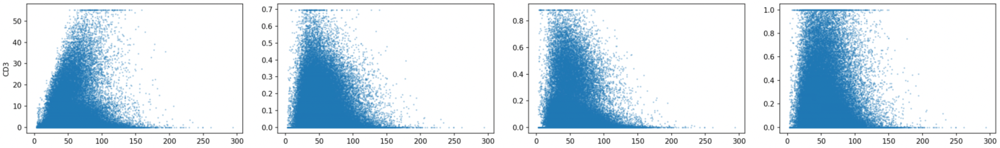

<h2>
  UNHUDDLE
  
</h2>

**Uncovering Neighborhood Heterogeneity Using Deterministic Normalization and Local Equilibrium**

## Introduction

<br>UNHUDDLE is an algorithm designed to resolve signal in densely packed tissue regions — or "cell huddles" — in multiplex spatial proteomics, where traditional absolute segmentation introduces 'neighbor noise' and blur the phenotypic signal.

On the cell to cell borderpixels, shared signal is observed due to  
1. resolution issues,
2. lateral bleed/signal spill
3. z-projection.  <br>

Unhuddle knows the cell's neighbors, measures their claim to borderpixelintensity and reallocates the bordersignal to the rightful owner. Unhuddle is equiped with an optional percentile denoiser that works on the core of the cell mask, that may be  effective on your dataset. 

Unhuddle values are normalized by total protein content per cell, but if cell size (surface area or perimeter) is preferred that can be set. Advanced users can choose for normalization against housekeeper protein expression. Additionally this method defends against regions with variation in overall expression, as is frequently seen in antibody based stainings.

The Unhuddle pipeline is built to empower all curious scientists — whether you're a coding pro or just getting started. Our walkthrough makes this process straightforward and accessible. You need to install Python and copy the provided commands to your terminal/shell. See for details:  [Install Python and work with command line interface](#-faq-for-new-users)   

Unhuddle runs directly on your multiplexed {marker}.ome.tiff image files, producing a comprehensive AnnData object that packages your cell-level features, masks, spatial coordinates, and marker intensities — all ready for analysis. If you don't have segmentation masks yet, Unhuddle can optionally generate them using the third-party tool DeepCell-Mesmer, enabling a truly end-to-end experience. Quick preprocessing can be handled within this repository through third party software PENGUIN, streamlining your data preparation before entering the main pipeline.

Once preprocessed, Unhuddle seamlessly integrates morphometrics, reallocation models, functional normalization, and quality control in one modular framework. The resulting AnnData object is extendable with custom metadata or omics layers and remains fully compatible with Scanpy and SpaceCat workflows. Example Jupyter notebooks are provided to guide you through downstream analyses and visualizations, making it easy to explore your data.

<p align="center">
  
</p>

---

<!-- Table of Contents -->
#### Quicklinks
- [Introduction](#introduction)
- [Tutorial](#-unhuddle-tutorial)
- [Run the pipeline](#-5-run-the-pipeline-on-included-demo-data)
- [Run pipeline on your own data](#-ready-for-your-own-data)
- [Extra information on the pipeline modules](#%EF%B8%8F-pipeline-overview)
- [FAQ](#-faq-for-new-users)  
- [PENGUIN streamlit app](#streamlit-anchor)
- [Download additional data](#download-data)
- [Install additional dependancies webloader for DeepCell-Mesmer Integration](#-6-deepcell-mesmer-integration-if-you-have-your-own-masks-you-can-skip-this-step)

---

### 🔧 **Preprocessing Your Raw Images**

Before running UNHUDDLE, we **highly recommend** some minimal pixel-level preprocessing of your raw `.ome.tiff` images. At a minimum, preprocessing should include:

- ✅ 99th highest percentile clipping (removal of oversaturated pixels)  
- ✅ Background subtraction

You can use the convenient streamlit app shipped with this repository:

[PENGUIN streamlit app](#streamlit-anchor)

<details>
<summary>Several open-source tools are available to help with IMC/MIBI data for this (click to expand):</summary>

---

### 🐧 **PENGUIN – Multiplex Tissue Image Preprocessing GUI**

- A user-friendly graphical interface for preprocessing multiplexed tissue images
- Available as a packaged Streamlit app **integrated in UNHUDDLE** (or use the jupyter notebook widget version on the 🔗  [PENGUIN](https://github.com/deMirandaLab/PENGUIN) github)

---

### 🧼 **IMC-Denoise – Deep Learning Denoising for IMC**

- Content-aware denoising pipeline tailored for Imaging Mass Cytometry (IMC)  
- Combines pixel artifact removal and self-supervised noise suppression  
- Best suited for high-noise or laser-induced artifact scenarios

🔗 GitHub: [IMC-Denoise](https://github.com/PENGLU-WashU/IMC_Denoise)

</details>


---

# 🚀 Unhuddle Tutorial

## 📥 1. Clone the Repository
via https
```bash
git clone https://github.com/tbee05/unhuddle_denoise.git
cd unhuddle_denoise
```
via ssh
```bash
git clone git@github.com:tbee05/unhuddle_denoise.git
cd unhuddle_denoise
```
## 📦 2. Set Up a Virtual Environment
Using `venv`

- On macOS/Linux:
```bash
python -m venv unhuddle-denoise
source unhuddle-denoise/bin/activate
```

- On Windows:
```bash
python -m venv unhuddle-denoise
unhuddle-denoise\Scripts\activate
```

or `conda`:
```bash
conda create -n unhuddle-denoise -y
conda activate unhuddle-denoise
conda install pip
```
## 🛠️ 3. Install UNHUDDLE in Editable Mode
```bash
pip install -e .
```
This installs unhuddle as a CLI tool available from anywhere in your terminal.

## ✅ 4. Verify Installation
```bash
unhuddle-denoise --help
```
Should print a list of CLI arguments and options.


## 🧪 5. Run the Pipeline on Included Demo Data
linux:
```bash
unhuddle-denoise \
  --base_path demodata \
  --output_base_path results/unhuddle_output \
  --nuclear_markers DNA1 DNA2 HistoneH3 \
  --create_nuclear_mask \
  --max_workers 1 \
  --create_adata
```
windows powershell
```powershell
unhuddle-denoise `
  --base_path demodata `
  --output_base_path results\unhuddle_output `
  --nuclear_markers DNA1 DNA2 HistoneH3 `
  --create_nuclear_mask `
  --max_workers 1 `
  --create_adata
```

[← Back to Table of Contents](#table-of-contents)

## 🌐 6. DeepCell-Mesmer Integration (if you have your own masks, you can skip this step)

UNHUDDLE can upload overlays to [DeepCell.org](https://deepcell.org) fully headless using Selenium and Firefox with GeckoDriver — **no GUI interaction**. This enables a fully automated pipeline from raw pixel data to single-cell DeepCell predictions and unhuddle clean-up.  
  
NB Deepcell is **third party software**, use the webloader responsibly and cite the authors please:  
*Greenwald, N.F., Miller, G., Moen, E. et al. Whole-cell segmentation of tissue images with human-level performance using large-scale data annotation and deep learning. Nat Biotechnol 40, 555–565 (2022). https://doi.org/10.1038/s41587-021-01094-0*

### 🛠️ Manual Setup: Firefox + GeckoDriver

If Firefox or GeckoDriver is not already installed, follow these steps to install:


<details>
<summary><strong>🐧 Linux Instructions</strong></summary>

### 🦊 1. Install Firefox (Portable)
```bash
mkdir -p "$HOME/tools"
cd "$HOME/tools"
wget "https://download.mozilla.org/?product=firefox-latest&os=linux64&lang=en-US" -O firefox.tar.bz2
tar -xjf firefox.tar.bz2
```

Firefox will now be available at:
```bash
$HOME/tools/firefox/firefox
```

💡 To make it available system-wide:
```bash
export PATH="$HOME/tools/firefox:$PATH"
```

👉 Add that line to your `.bashrc` or `.zshrc` to make it permanent.

### 🧭 2. Install GeckoDriver
```bash
cd "$HOME/tools"
wget https://github.com/mozilla/geckodriver/releases/download/v0.35.0/geckodriver-v0.35.0-linux64.tar.gz
tar -xvzf geckodriver-*.tar.gz
chmod +x geckodriver
```

✅ This is the updated path for the placeholder 'path/to/your/geckodriver' in `--geckodriver_path path/to/your/geckodriver`:
```bash
$HOME/tools/geckodriver
```

💡 Add to PATH:
```bash
export PATH="$HOME/tools:$PATH"
```

[← Back to Table of Contents](#quicklinks)

</details>


<details>
<summary><strong>🍎 macOS Instructions</strong></summary>

### 🦊 1. Install Firefox
Download from:  
[https://www.mozilla.org/en-US/firefox/new/](https://www.mozilla.org/en-US/firefox/new/)

Or manually place `Firefox.app` in a custom folder like:
```bash
$HOME/tools/Firefox.app
```

💡 To use it in scripts:
```bash
export PATH="$HOME/tools/Firefox.app/Contents/MacOS:$PATH"
```

### 🧭 2. Install GeckoDriver
```bash
cd "$HOME/tools"
curl -LO https://github.com/mozilla/geckodriver/releases/download/v0.35.0/geckodriver-v0.35.0-macos.tar.gz
tar -xvzf geckodriver-*.tar.gz
chmod +x geckodriver
```

✅ This is the updated path for the placeholder 'path/to/your/geckodriver' in `--geckodriver_path path/to/your/geckodriver`:
```bash
$HOME/tools/geckodriver
```

💡 Add to PATH:
```bash
export PATH="$HOME/tools:$PATH"
```

[← Back to Table of Contents](#quicklinks)

</details>


<details>
<summary><strong>🪟 Windows Instructions (PowerShell)</strong></summary>

### 🦊 1. Install Firefox
Download from:  
[https://www.mozilla.org/en-US/firefox/new/](https://www.mozilla.org/en-US/firefox/new/)

During installation, choose **Custom Setup** and install to:
```
%USERPROFILE%\tools\Firefox
```

💡 If you did not get prompted to add firefox to `path` during installation, you can add manually in the terminal via this command:
```powershell
[System.Environment]::SetEnvironmentVariable("Path", $env:Path + ";$env:USERPROFILE\tools\Firefox", [System.EnvironmentVariableTarget]::User)
```

### 🧭 2. Install GeckoDriver
```powershell
$toolsDir = "$env:USERPROFILE\tools"
New-Item -ItemType Directory -Force -Path $toolsDir
Set-Location -Path $toolsDir

Invoke-WebRequest -Uri "https://github.com/mozilla/geckodriver/releases/download/v0.35.0/geckodriver-v0.35.0-win64.zip" -OutFile "$toolsDir\geckodriver.zip"
Expand-Archive -Path "$toolsDir\geckodriver.zip" -DestinationPath $toolsDir -Force
Remove-Item "$toolsDir\geckodriver.zip"
```

💡 Add GeckoDriver to your `PATH`:
```powershell
[System.Environment]::SetEnvironmentVariable("Path", $env:Path + ";$env:USERPROFILE\tools", [System.EnvironmentVariableTarget]::User)
```

✅ This is the updated path for the placeholder 'path/to/your/geckodriver' in `--geckodriver_path path/to/your/geckodriver`: 
```
%USERPROFILE%\tools\geckodriver.exe
```

[← Back to Table of Contents](#quicklinks)

</details>


<details>
<summary><strong>🧪 Verify Installation</strong></summary>

Run these to check that Firefox and GeckoDriver are installed correctly:

#### 🐧 macOS / Linux:
```bash
$HOME/tools/firefox/firefox --version
$HOME/tools/geckodriver --version
```

#### 🪟 Windows PowerShell:
```powershell
& "$env:USERPROFILE\tools\Firefox\firefox.exe" --version
& "$env:USERPROFILE\tools\geckodriver.exe" --version
```

[← Back to Table of Contents](#quicklinks)

</details>

[← Back to Table of Contents](#quicklinks)

---


<br>

## 🚀 7. Get more out of the data with Unhuddle extensions


<details open id="download-data">
<summary><h3>Download Additional Demo Data for Testing of the Denoiser</h3></summary>

The following commands will automatically download and unpack all available demo FOVs into `demodata/{FOV}` using the latest GitHub release (1.5GB after expansion).

#### 🐧 Linux / macOS / WSL
```bash
[ -d demodata ] && [ -f README.md ] && echo "Cleaning demodata..." && \rm -rf demodata; mkdir -p demodata; curl -s https://api.github.com/repos/Tbee05/Unhuddle_demodata/releases/latest | grep browser_download_url | grep '.tar.gz"' | cut -d '"' -f 4 | while read -r url; do fov=$(basename "$url" .tar.gz); mkdir -p demodata/$fov; curl -L "$url" -o ${fov}.tar.gz; tar -xzf ${fov}.tar.gz -C demodata/$fov --strip-components=1; rm ${fov}.tar.gz; done
```

#### 🪟 Windows (PowerShell)
```powershell
if (Test-Path "demodata" -and Test-Path "README.md") { Write-Host "Cleaning demodata..."; Remove-Item -Recurse -Force demodata }; New-Item -ItemType Directory -Path "demodata" -Force | Out-Null; (Invoke-RestMethod https://api.github.com/repos/Tbee05/Unhuddle_demodata/releases/latest).assets | Where-Object { $_.name -like "*.tar.gz" } | ForEach-Object { $url = $_.browser_download_url; $fov = [IO.Path]::GetFileNameWithoutExtension($_.name); Invoke-WebRequest -Uri $url -OutFile "$fov.tar.gz"; New-Item -ItemType Directory -Path "demodata\$fov" -Force | Out-Null; tar -xzf "$fov.tar.gz" -C "demodata\$fov" --strip-components=1; Remove-Item "$fov.tar.gz" }
```

📂 The extended demodate set contains 134k cells, which allows you to rerun the UNHUDDLE pipeline with the `--use_denoise` flag.  
(tip you can now collapse this section)

[← Back to Table of Contents](#quicklinks)

</details>  

---


### Test the extensions on the demodata
- If you've downloaded the additional demodata add these lines to the call (see step 5). NB output will now be in `results_extended`.  
(tip: compile call in a texteditor and make sure all your lines -but the last- have a continuation indicator: `\`, for windows change to ` )

[← Check the command in Step 5](#-5-run-the-pipeline-on-included-demo-data)

```bash
--output_base_path results_extended \
--use_denoise \
--add_dimensionreduction_coords demodata-tsne \
--coord_cols optsne_1 optsne_2
```


- If Firefox + GeckoDriver are installed add these lines to the call (see step 5), nb extended demodata not needed:  
(make sure all your lines, but the last have a continuation indicator: `\`, for windows change to ` )
```bash
--create_deepcell_mask \
--membrane_markers_overlay CD20 CD68 CD11b CD11c CD8a CD3 CD7 CD45RA CD45RO CD15 CD163 Vimentin CD31 CD14 CD4 CD56 SMA TCRgd \
--geckodriver_path /path/to/your/geckodriver
``` 


---

---

## Congrats you made it to the end of the tutorial! 

<details>
<summary><strong>Inspect output folder</strong></summary>

```yaml
<output_base_path>/
├── processed_data/                # data tables as {fov}.csv
│   ├── original_tables/           
│   │   ├── original_sum/          # Before unhuddle -intensity sums
│   │   └── original_normalized/   # Before unhuddle -normalized
│   ├── unhuddle_sum/              # After unhuddle -intensity sums
│   ├── unhuddle_normalized/       # After unhuddle -normalized
│   ├── unnuddle_denoised_sum/     # After unhuddle -denoised intensity sums (if --use_denoise) 
│   └── unhuddle_denoised_normalized/  # After unhuddle -denoised and normalized (if --use_denoise)
│
├── features/
│   ├── morphology_features/       # Per-cell morphology metrics
│   └── protein_features/          # Per-cell raw protein intensities
│
├── QC/                            # see next section for QC (if --create_adata)
│
├── adata_objects/                 # see next section for AnnData (if --create_adata)
│
├── logs/                          # One log file per run
│
└── cli_call.txt                   # Exact CLI invocation parameters
```
</details>  

<details>
<summary><strong>QC and visualisations</strong></summary>

```yaml
QC/
│
├── filtering/                # Filtering strategy
│   ├── total_intensity_distribution.png            
│   │                         # see --low_intensity_threshold on distribution
│   ├── density_maps/         # Kernel density plots of low-intensity cells
│   │   └── <FOV>.png
│   │
│   ├── segmentation/         # Overlay filtering QC on segmentation masks
│   │   └── <FOV>.png             
│   │
│   ├── storyboards/          # Combined "storyboard" images
│   │   ├── density_storyboard.png
│   │   │                     # All density_maps in a single grid
│   │   └── segmentation_storyboard.png # All segmentation overlays stacked
│   │                         # All per fov images -filtering QC on segmentation masks- in a single grid 
│   ├── dr_qc.png             # Filtering results on dimension reduction embedding (if present)
│   ├── overall_stats.csv     # Cohort‐wide cell‐count & filter metrics
│   └── per_fov_stats.csv     # Per‐FOV cell‐count & filter metric
│
├── denoiser/                 # (if `--use_denoise`) Denoiser diagnostics
│   └── denoiser_QC.pdf       # plotting of percentile curve and residuals
│
└── normalization/            # metadata normalization and scaling
    ├── norm_plots/
    │   ├── normalization_per_marker.png
    │   │                     # raw, /sensormarker, /size metric, after scaling (selected method)
    │   └── normalization_comparison_summary.png # All cells
    └── norm_stats/
        ├── original_cohort_marker_qc.csv
        ├── unhuddle_cohort_marker_qc.csv
        │                     # normalization method per marker
        └── unhuddle_cohort_marker_qc.csv

```  
</details>  


  
</details>  

<details>
<summary><strong>Inspect your adata object in jupyter notebook</strong></summary>

```python
import os
import pandas as pd
import anndata as ad

# Paths
print("Notebook working dir (sanity check):", os.getcwd())
adata_path = "/results/unhuddle_output/adata_objects/adata1.h5ad"

# Load AnnData
adata = ad.read_h5ad(adata_path)
adata
```

Will give you this summary object (for further usage see below):

```
AnnData object with n_obs × n_vars = 134299 × 39
    obs: 'Area', 'Perimeter', 'Convex_Area', 'Solidity', 'BoundingBox_Area', 'Extent', 'Orientation', 'Eccentricity', 'Equivalent_Diameter', 'Major_Axis_Length', 'Minor_Axis_Length', 'Major_Minor_Axis_Ratio', 'Circularity', 'Form_Factor', 'Euler_Number', 'Nucleus_Area', 'Nucleus_Eccentricity', 'NC_Area_Ratio', 'Centroid_Deviation', 'Mean_DNA1_Intensity', 'Integrated_DNA1_Intensity', 'Mean_DNA2_Intensity', 'Integrated_DNA2_Intensity', 'Mean_HistoneH3_Intensity', 'Integrated_HistoneH3_Intensity', 'QC_no_nucleus', 'fov', 'patient_id', 'summed_intensity', 'total_intensity', 'QC_low_intensity_filter', 'QC_filter_low_quality_region', 'filtering_status', 'QC_fraction_filtered', 'QC_dr_based_filter', 'QC_final_keep'
    uns: 'X_source', 'dr_source', 'fov-list', 'marker-list', 'patient_id-list', 'spatial'
    obsm: 'X_spatial', 'X_tsne'
    layers: 'ExclMem_Sum', 'sum_original', 'sum_unhuddle', 'sum_unhuddle_denoised'
```

</details>  

[← Back to Table of Contents](#quicklinks)

---

---

# 🚀🚀 Ready for your own data?

## 🗂️ Check Input Requirements

The base input directory should contain one folder per FOV:

```
base_path/
├── FOV1/
│   ├── CD3.ome.tiff
│   ├── CD20.ome.tiff
│   └── ...
├── FOV2/
│   ├── CD3.ome.tiff
│   └── ...
```
Each FOV folder should contain:
- Denoised marker images (`{marker}.ome.tiff`, shape: `H x W`, dtype: `float32/64`)
- Optionally: a segmentation mask (`*.tiff`, shape:   `H x W` or `Z x H x W`, dtype: `uint16`)  
  NB do not use *ome.tiff for the mask  
  NB the pipeline will detect and squeeze the Z dimension automatically)  
  If a mask is not provided, one can be generated using `--create_deepcell_mask`.

🎯**protip:**  
contain the patientID in the FOV-name: `{patientID}_{FOVnumber}`.  
NB do not use underscores `_` within patientID or FOVnumber.
 
example for the first fov of **P**atient **23**:
```
base_path/
├── P23_1/
│   ├── CD3.ome.tiff
```
## Reuse the command from step 5 for your real data!

[← Check the command in Step 5](#-5-run-the-pipeline-on-included-demo-data)

1. Replace `--base_path demodata` with the actual path to your folder containing `{FOV}\` subdirectories.
2. Replace `--output_base_path` with a fresh folder output name.
3. Use `--list_available_markers` and run the command.
4. Update the `--nuclear_markers`. 
5. Have your own masks? Add `--mask_pattern` --> Glob pattern to find your mask (e.g. `*_mask.tiff`). **NB:** Do not use `*.ome.tiff`.
6. You do not have your own masks? Try the deepcell webloader function! Make sure to install Firefox and GeckoDriver, add the flags `--create_deepcell_mask` and `--geckodriver_path` (add actual GeckoDriver path).
   5.1. Run the pipeline and check the overlay files. Want to adapt the markers used for the overlay? Use the overrides: `--nuclear-markers_overlay` and `--membrane-markers_overlay`, then rerun.
7. Experimental: `use_denoise`. Supported denoising strategies are learning the relationship between cell size and noise (`--denoise_method noise cone`) or simply regard lower percentile as noise (`--denoise_method percentile). Inspect the visual QC if this makes sense on your data!
8. Inspect all QC. Are you happy? Run dimension reduction using your favorite algorithm (currently not supported in Unhuddle) and load the coordinates in the pipeline using:
   - `--add_dimension_reduction path/to/your_dr_coords`
   - `--coord_cols yourcolname_1 yourcolname_2`
   - `--check_output_exist`
   
   Rerun and you will see your filtering results in your dimension reduction render, which will be very helpful during phenotyping.
9. Proceed to phenotyping using your preferred method. Use the Jupyter notebook file to load the phenotypes as obs in your adata object and make use of the random forest classifier to classify your 'hard to classify' cells! Add your metadata and your other omic data. Render additional QC images and explore your data!
10. Not a pro in Scanpy and adata for analysis and visualization? The attached notebook will guide you to print a comprehensive summary of your adata object that can be interpreted by your favorite LLM. As your LLM is now aware of how to link all data, you can just instruct the chatbot in plain language your needs and it will give you Jupyter notebook snippets to project features on your dimension reduction plot, render tissue images color-coded for the various cell types, perform group comparisons, etc [LLM instruction example prompt](#use-llm-to-ask-semantic-biological-questions). Happy sciencing!

PRO-USAGE:
11. subset markers used for normalization to for example housekeeper protein `--normalization_markers` (default is all)
12. normalize based on 'area' instead of protein intensity `--normalization area`

[← Back to Table of Contents](#quicklinks)

---

---

## ⚙️ Pipeline Overview

For each FOV (field of view) folder, the following stages are run:

### 1. **Mask Processing & Interaction Computation**
- Segment cells, nuclei, and membranes using the provided marker images.
- Compute:
  - Border interactions (via membrane adjacency)
  - Background interactions (via contact with empty space)
- Output: a typed interaction dictionary used to model per-pixel signal flow.

### 2. **Feature Extraction**
- Extract per-cell morphological features (e.g., area, eccentricity, nucleus/cell ratios).
- Output saved to `/morphology_features/{fov}.csv`.

### 3. **Protein Intensity Extraction**
- Compute per-cell marker intensities using:
  - Cell mask
  - Membrane mask
  - Membrane exclusion mask
- Nuclear markers are excluded from this step.
- Output saved to `/protein_features/{fov}.csv`.

### 4. **Reallocation and Rescaling**
- Merge morphological and protein features with the interaction dictionary.
- Redistribute per-pixel intensities across interacting objects using weighted contributions.

#### **Canonical Branch (Default)**
- **Intensity Source**: `{}_ExclusionMembrane_Mean_Intensity` columns
- **Reallocation Weights**: Based on original mean intensities
- **Sum Compilation**: `original_sum + reallocated_intensity - taken_intensity`
- Output: `/unhuddle_sum/{fov}.csv`

#### **Denoised Branch (Experimental)**
- **Intensity Source**: `{}_ExclusionMembrane_Mean_Intensity_denoised` columns
- **Reallocation Weights**: Based on denoised mean intensities (consistent with canonical branch)
- **Standard Sum Compilation**: `denoised_residuals + reallocated_intensity + solo_border_pixels`
- **Optional Alternative Compilation**: Use `--add_original_compiled_sum` to also generate `original_sum + reallocated_intensity - taken_intensity` (like canonical branch)
- Output: 
  - `/unhuddle_denoised_sum/{fov}.csv` (standard method)
  - `/unhuddle_denoised_sum_original_style/{fov}.csv` (if `--add_original_compiled_sum` is used)

### 5. **Normalization**
- Apply normalization using total protein expression per cell (allow only phenotype_markers to contribute):
  - Sum phenotype marker expression after unhuddle per cell
  - Normalize per pixel surface 'Area'
- Scale the values back to 0-1 range using full cohort data:
  - If a marker has enough dynamic range; apply robust scaling to [0.1, 99.9] percentile range
  - Falls back to binarisation when insufficient dynamic range, reports in QC
- Denoised reallocation intensities are used if `--use_denoised` is active.
- Output:
  - `/unhuddle_normalized/{fov}.csv`
  - `/original_normalized/{fov}.csv`

  

#### 🖼️ Normalization Visualization Module
- Generates:
  - Per-marker normalization range comparisons
  - Scatter plots of pre/post-normalized values
  - Cohort-level scaling factors
- All outputs saved to `/qc_normalization_plots/`
  
---

If preferred, users can perform **custom** normalization and scaling **post pipeline** using the adata object:

```python
# Simple per-area normalization
adata.layers["sum_unhuddle_per_area"] = adata.layers["sum_unhuddle"] / adata.obs["Area"].values[:, None]
adata.X = adata.layers["sum_unhuddle_per_area"].copy()
adata.uns["X_source"] = "sum_unhuddle_per_area"
```
This example jupyter notebook snippet provides a simple per-unit-area normalization, which may be preferable in specific use cases.

🔁 Tip: All raw and processed intensity layers are preserved in the AnnData object for flexible reanalysis.


---

## 📦 Optional Modules

### 6. **DeepCell Mask Creation** (third party software)
- If `--create_deepcell_mask` is enabled:
  - RGB overlays are constructed from marker images to highlight relevant structures for segmentation.
  - By default, the overlay uses the markers specified in `--normalization_markers` and `--nuclear_markers`.
  - You can **override the default overlay composition** using:
    - `--membrane_markers_overlay`
    - `--nuclear_markers_overlay`
  - Uploaded to [DeepCell.org](https://deepcell.org) using a headless Selenium session
  - Results are downloaded and integrated into downstream segmentation

---


### 7. **AnnData Object Creation**
- If `--create_adata` is used:
  - All per-FOV features, masks, and normalized intensities are assembled into a single `.h5ad` file
  - Includes QC flags, overlays, and spatial information
  - Compatible with `scanpy`, `napari`, and `SpaceCat` pipelines

### 8. **Automated Filtering & Embedding QC**
- Performed automatically on the assembled AnnData object
- Includes:
  - Low-intensity filtering (`QC_low_intensity_filter`)
  - Local density filtering (`QC_dr_based_filter`)
  - Optional spatial smoothing or embedding overlays
- Visual outputs:
  - Histograms of marker intensity
  - Density maps
  - Annotated DR embeddings (e.g., t-SNE, FIt-SNE)
  - Summary figures for each cohort
- Output:
  - `/qc_pipeline/` with all summary PDFs and CSVs


## 🧰 Available Arguments

### 📂 Input / Output

| Argument                     | Description |
|-----------------------------|-------------|
| `--base_path`               | **Required** Path to folder containing FOV subfolders |
| `--output_base_path`       | **Required** Where to write processed outputs (will be created) |
| `--fovs`                   | List of FOV folder names to process (optional) |
| `--mask_pattern`           | Glob pattern(s) for user imported mask files (e.g. `*_mask_0.tiff`). NB do not use `*.ome.tiff` |
| `--check_output_exist`     | Skip FOVs if output already exists |
| `--create_adata`           | Reconciles all data into a single `.h5ad` file |

### 🎨 Marker definitions

| Argument                     | Description |
|-----------------------------|-------------|  
| `--normalization_markers` | **Required** unless using `--list_available_markers` |
| `--nuclear-markers`            | **Required** unless using `--list_available_markers` |  
| `--list_available_markers` | List markers and exit |

### ⚙️ Processing Options

| Argument                     | Description |
|-----------------------------|-------------|
| `--max_workers`            | Number of parallel processes (default: 1) |
| `--create_nuclear_mask`    | Generate nuclear mask from cell mask (enables N/C ratio) |
| `--create_deepcell_mask`   | Generate RGB overlay & segment via webloader with DeepCell Mesmer|

### 🌐 DeepCell Settings 

| Argument                   | Description |
|---------------------------|-------------|
| `--geckodriver_path`       | Path to geckodriver for Selenium. **Required when** `--create_deepcell_mask` is used. |
| `--deepcell_url`           | URL of the DeepCell website to connect to (default: `http://www.deepcell.org`). |
| `--deepcell_resolution`    | Objective magnification used for DeepCell overlay creation. Must be one of:<br><br>• `10` → 10x (1 μm/pixel)<br>• `20` → 20x (0.5 μm/pixel)<br>• `40` → 40x (0.25 μm/pixel)<br>• `60` → 60x (0.1667 μm/pixel)<br>• `100` → 100x (0.1 μm/pixel)<br><br>**Required when** `--create_deepcell_mask` is used. |

### 🎨 RGB overlay creation
| Argument                   | Description |
|---------------------------|-------------|
| `--nuclear-markers_overlay`            | Markers for red channel override (nuclear) default: use `nuclear_markers`|  
| `--membrane-markers_overlay`          | Markers for green channel override (membrane/cytoplasm) default: use `normalization_markers` |  
| `--blue-markers`           | Optional markers for blue channel |

---

### 🧽 Denoising & Normalization

| Argument              | Description                                                                                     |
|-----------------------|-------------------------------------------------------------------------------------------------|
| `--use_denoised`      | Enables **cohort-level denoising** of marker intensities using signal vs. noise cone modeling. |
| `--add_original_compiled_sum` | Add extra denoised sum data using original-style compilation (original_sum + reallocated - taken) in addition to the standard solo-border method. This creates an additional layer in the AnnData object. |
| `--normalization_markers` | Required. Markers used for per-cell normalization (e.g., CD45, Vimentin).                 |
| `--nuclear_markers`   | Required. Markers used for nucleus detection and morphology extraction.                        |

---

### 🧬 AnnData QC & Filtering

| Argument                        | Description                                                                                  |
|----------------------------------|----------------------------------------------------------------------------------------------|
| `--no_qc`                        | Disables the QC filtering pipeline on the final AnnData object.                             |
| `--low_intensity_threshold`      | Minimum total intensity to retain a cell (default: `10`).                                   |
| `--qc_density_threshold`         | Density threshold for local density map filtering (default: `550`).                         |
| `--qc_plot_density_scale`        | Value range for density map visualization (default: `0 800`).                               |
| `--radius_DRfilter`             | Radius used in neighborhood filtering on DR embedding (default: `0.8`).                     |

> 🛠️ Advanced tuning parameters (usually fixed, can be overridden):
> - `--qc_window_size` (default `50`) – Sliding window size for density computation.
> - `--qc_stride` (default `10`) – Stride used when computing local density.
> - `--qc_region_threshold` (default `0.8`) – Minimum fraction of neighborhood pixels that must be high-density.

---

### 🧭 Dimension Reduction

| Argument                             | Description                                                                                      |
|--------------------------------------|--------------------------------------------------------------------------------------------------|
| `--fitsne`                           | Run FIt-SNE locally for QC-annotated embeddings. Requires extended setup!                |
| `--add_dimensionreduction_coords`    | Path to folder with `{fov}.csv` files having: `Label`, `dr_1`, `dr_2` columns.                   |
| `--coord_cols`                       | Names of the coordinate columns in the supplied CSVs (default: `dr_1 dr_2`). support: umap, tsne, fitsne, optsne, phate, pca              |


---

### 🪵 Logging

| Argument         | Description                                  |
|------------------|----------------------------------------------|
| `--log-level`    | One of: `DEBUG`, `INFO`, `WARNING`, `ERROR`  |

---
## 🧬 UNHUDDLE AnnData Object Guide
### 🧬 `adata.obs` — Per-cell annotations

| Column              | Description                                                                   |
|---------------------|-------------------------------------------------------------------------------|
| `cell_id` *(index)* | Unique cell identifier: **`{fov}_{Label}`**, e.g., `P23_1_42`                 |
| `fov`               | Field of View name: **`{patientID}_{FOVnumber}`**, e.g., `P23_1`              |
| `patient_id`        | Derived from FOV name, e.g., `P23`                                            |
| `summed_intensity`  | Total protein intensity for that cell (sum of normalized values)              |
| `QC_no_nucleus`     | Boolean flag indicating missing nuclear signal                                |
| `QC_low_intensity_filter` | Flag marking cells below total intensity threshold                     |
| `QC_dr_based_filter`      | Flag marking cells filtered based on DR-embedding neighborhood density |
| `...`               | All other extracted morphology features (area, eccentricity, etc.)            |


---

### 🎯 `adata.X` — Normalized protein expression

- Shape: `[n_cells, n_markers]`
- Values are in `[0, 1]`, robustly scaled
- Marker names are in `adata.var_names`

---

### 📚 `adata.var_names`

- List of markers (channels) used for quantification

---

### 🌍 `adata.obsm`

| Key               | Description                                               |
|------------------|-----------------------------------------------------------|
| `spatial`         | `[Centroid_Row, Centroid_Col]`                            |
| `nuclear_spatial` | `[Nucleus_Centroid_Row, Nucleus_Centroid_Col]`           |

---

### 🧬 `adata.layers`

| Layer Key         | Description                                               |
|-------------------|-----------------------------------------------------------|
| `sum_unhuddle`    | Corrected per-cell intensities before normalization       |
| `sum_original`    | Raw intensities prior to interaction reallocation         |
| `sum_unhuddle_denoised` | Denoised per-cell intensities (if `--use_denoised` is used) |
| `sum_unhuddle_denoised_original_style` | Alternative denoised compilation method (if `--add_original_compiled_sum` is used) |

---

### 🧪 `adata.uns`

| Key                | Description                                              |
|--------------------|----------------------------------------------------------|
| `marker-list`      | List of measured marker names                            |
| `fov-list`         | All FOV identifiers (e.g., `P23_1`)                      |
| `patient_id-list`  | All unique patient IDs                                   |
| `spatial`          | Dict of segmentation masks per FOV                       |
| → `spatial[fov]['segmentation']` | 2D numpy array with segmentation labels   |

---

## 🧠 Identifier Format

- `cell_id` = `{fov}_{Label}`  
  Example: `P23_1_42`

- `fov` = `{patientID}_{FOVnumber}`  
  Example: `P23_1`

- `Label` = integer ID in segmentation masks (i.e., pixel regions in `.tiff`)

---
## Use LLM to ask semantic biological questions

**Example prompt to instruct on the structure and the conventions of your AnnData object**

```yaml
In my Jupyter notebook, I have loaded an AnnData object from the Unhuddle pipeline. I want you to understand the structure.

AnnData object with n_obs × n_vars = 134299 × 39

obs: 'Area', 'Perimeter', 'Convex_Area', 'Solidity', 'BoundingBox_Area', 'Extent', 'Orientation', 'Eccentricity', 'EquivDiameter', ...
uns: 'X_source', 'dr_source', 'fov-list', 'marker-list', 'patient_id-list', 'spatial'
obsm: 'X_spatial', 'X_tsne'
layers: 'ExclMem_Sum', 'sum_original', 'sum_unhuddle', 'sum_unhuddle_denoised'

# Special conventions:
# cell_id = X.index → {fov}_{Label}
# fov → {patient_id}_{FOVnumber}
# Label → Integer ID from segmentation masks
# NB obs contain "fov" and "patient_id" for keying

# Example to access a segmentation mask for a specific FOV:
segmentation_mask = adata.uns['spatial'][fov]['segmentation']

# Example QC filtering:
adata_filtered = adata[adata.obs["QC_final_keep"]].copy()
```

---


### ⚙️ User Control and Alternatives

If preferred, users can **bypass cohort-wide normalization** and apply their own normalization or scaling by accessing the unhuddled sum intensity layer:

```python
# Set other layer as the main data matrix (X)

#save current matrix in layer:
adata.layers["normalized_unhuddle"] = adata.X

#set sum_unhuddle layer in X:
adata.X = adata.layers["sum_unhuddle"].copy()

#update the the tag X_source declaring what is in X
adata.uns["X_source"] = "sum_unhuddle"
```
This provides a simple per-unit-area normalization, which may be preferable in specific use cases.

🔁 Tip: All raw and processed intensity layers are preserved in the AnnData object for flexible reanalysis.

## 📎 Notes
✅ Python Compatibility:
Requires Python 3.8 or higher

## ❓ FAQ for New Users

---

<details><summary><h3>Q1. What is the Command Line Interface (CLI) and why should I use it?</h3></summary>


➡️ The Command Line Interface (CLI) is a text-based way to interact with your computer. Instead of clicking buttons, you type commands to execute programs and scripts.  

✅ The CLI is ideal for automation, reproducibility, and handling large datasets — it's like giving your computer direct instructions, making processes faster and more efficient.  

💡 To open the CLI on your system:  
- **Windows**: Use **Git Bash** (installed with Git), or search for **Command Prompt** or **PowerShell** in the Start menu.  
- **macOS**: Use the built-in **Terminal** app (via Spotlight or Applications > Utilities).  
- **Linux**: Use your default **Terminal** app (Ctrl+Alt+T typically opens it).

[← Back to Table of Contents](#quicklinks)

</details>

---

<details><summary><h3>Q2. I don't have Python installed. What should I do?</h3></summary>


➡️ **Windows:** Download from [python.org/downloads/windows](https://www.python.org/downloads/windows/)  
✅ During installation, **check the box "Add Python to PATH."**

➡️ **macOS:** Python 3 is often pre-installed, but it's recommended to install via [Homebrew](https://brew.sh/):  
```bash
brew install python
```

➡️ **Linux (Debian/Ubuntu):**  
```bash
sudo apt update && sudo apt install python3 python3-pip
```

➡️ **Linux (RedHat/Fedora):**  
```bash
sudo dnf install python3
```

[← Back to Table of Contents](#quicklinks)

</details>

---

<details><summary><h3>Q3. I don't have Git installed. Where can I get it?</h3></summary>


➡️ **Windows:** Install from [git-scm.com/download/win](https://git-scm.com/download/win)  
✅ This also installs **Git Bash**, a terminal that supports Linux-style commands.  
💡 If you run **Unhuddle** from Git Bash, you can follow **Linux command syntax** even on Windows.

➡️ **macOS:** Install Git via Homebrew:  
```bash
brew install git
```

➡️ **Linux (Debian/Ubuntu):**  
```bash
sudo apt update && sudo apt install git
```

➡️ **Linux (RedHat/Fedora):**  
```bash
sudo dnf install git
```


[← Back to Table of Contents](#quicklinks)

</details>

---

<details><summary><h3>Q4. Why is there no graphical user interface?</h3></summary>

We currently provide a command-line interface (CLI) because it's the most flexible, scalable, and automation-friendly format for researchers working with complex datasets. A graphical user interface (GUI) may follow in the future.


[← Back to Table of Contents](#quicklinks)

</details>

---

<details><summary><h3>Q5. I heard command line is powerful and may be dangerous for people without formal training?</h3></summary>


  
➡️ It's true that the command line is powerful — it's used by professionals to automate complex workflows and manage entire systems efficiently. But power doesn't mean danger if you're using trusted commands.  
✅ The commands in our guides have been carefully written and reviewed to be safe.

🧠 Curious or cautious? You can always paste any command into your favorite AI assistant or chatbot (like ChatGPT, Copilot, etc.) and ask:

"Can you explain what this command does?"

That way, you're always in control — and learning while using the tools safely.

[← Back to Table of Contents](#quicklinks)

</details>

---

<details open id="streamlit-anchor"><summary><h2>🧪 Launch the Streamlit version of PENGUIN</h2></summary>
  
#### 🔁 Step-by-step (Mac/Linux/Windows)

Credits: Sequeira, A. M., Ijsselsteijn, M. E., Rocha, M., & de Miranda, N. F. (2024). PENGUIN: A rapid and efficient image preprocessing tool for multiplexed spatial proteomics. bioRxiv, 2024-07. doi: https://doi.org/10.1101/2024.07.01.601513
1. **Clone the Repository** (this is the same step as STEP 1 from the main flow, there is no need to clone twice)  
    - via https:
        ```bash
        git clone https://github.com/tbee05/unhuddle_denoise.git
        cd unhuddle_denoise
        ```
    - or via ssh:
        ```bash
        git clone git@github.com:tbee05/unhuddle_denoise.git
        cd unhuddle_denoise
        ```
        
2. **Create a virtual environment** (make a dedicated environment for penguin)
    ```bash
    python -m venv .venv_penguin
    ```

3. **Activate it**
    - On macOS/Linux:
        ```bash
        source .venv_penguin/bin/activate
        ```
    - On Windows:
        ```powershell
        .venv_penguin\Scripts\activate
        ```

4. **Install requirements**
    - On macOS/Linux:
        ```bash
        pip install -r ./penguin_preprocess/requirements.txt
        ```
    - On Windows:
        ```powershell
        pip install -r .\penguin_preprocess\requirements.txt
        ```
       
5. **Run the app**
    ```bash
    streamlit run app.py
    ```
    
[← Back to Table of Contents](#quicklinks)

<details>
<summary><h3> More raw data images needed to test this Streamlit version of PENGUIN? (expand!)</h3></summary>


**Download raw image data** Oneliners that will download and unpack all available raw demo FOVs into `demodata-raw/{FOV}` (1.5GB).

#### 🐧 Linux / macOS / WSL (make sure you are still in the unhuddle base directory!)
```bash
rm -rf demodata-raw && mkdir -p demodata-raw && curl -s https://api.github.com/repos/Tbee05/Unhuddle-raw/releases/latest | grep browser_download_url | grep '.tar.gz"' | cut -d '"' -f 4 | while read -r url; do fov=$(basename "$url" .tar.gz); mkdir -p demodata-raw/$fov && curl -L "$url" -o ${fov}.tar.gz && tar -xzf ${fov}.tar.gz -C demodata-raw/$fov --strip-components=1 && rm ${fov}.tar.gz; done
```

#### 🪟 Windows (PowerShell) (make sure you are still in the unhuddle base directory!)
```powershell
Remove-Item -Recurse -Force demodata-raw -ErrorAction Ignore; New-Item -ItemType Directory -Path "demodata-raw" -Force | Out-Null; (Invoke-RestMethod https://api.github.com/repos/Tbee05/Unhuddle-raw/releases/latest).assets | Where-Object { $_.name -like "*.tar.gz" } | ForEach-Object { $url = $_.browser_download_url; $fov = [IO.Path]::GetFileNameWithoutExtension($_.name); Invoke-WebRequest -Uri $url -OutFile "$fov.tar.gz"; New-Item -ItemType Directory -Path "demodata-raw\$fov" -Force | Out-Null; tar -xzf "$fov.tar.gz" -C "demodata-raw\$fov" --strip-components=1; Remove-Item "$fov.tar.gz" }
```

[← Back to Table of Contents](#quicklinks)

</details>


</details>


## 📊 Coming Soon
UNHUDDLE will be installable via `pip install unhuddle`

## 📣 Citation & License
This tool is part of an ongoing research pipeline for high-dimensional tissue profiling originating from the Alizadeh laboratory at Stanford School of Medicine.
Please cite appropriately once a manuscript is available. Open-source license to be defined.


